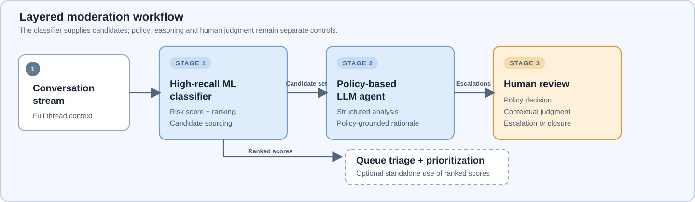
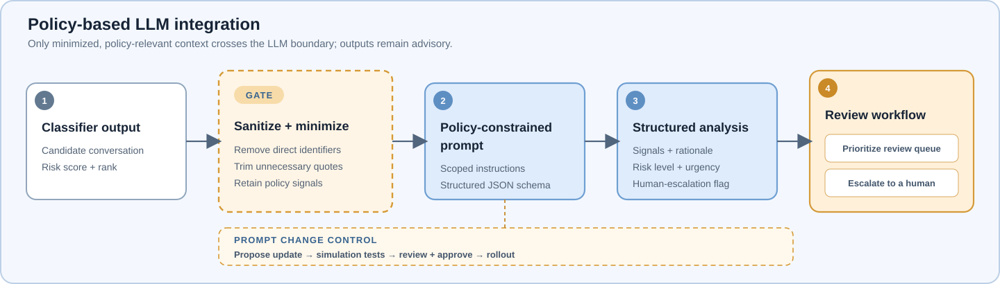
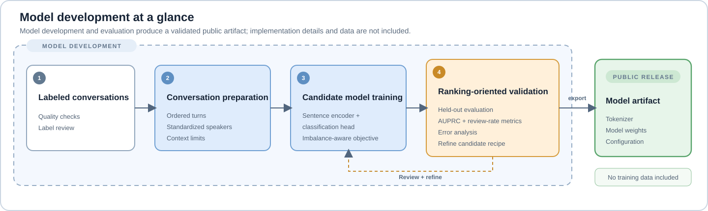
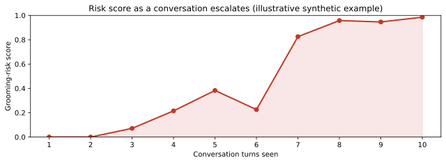
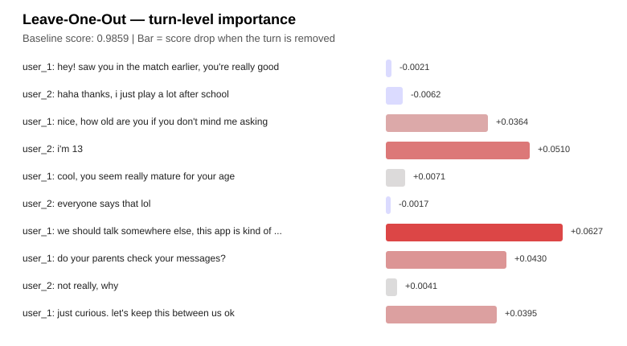

# SIE Grooming Risk Classifier

This repository contains the public release of SIE's text-based grooming-risk classifier. It scores conversations for potential child safety risks, helping teams identify which ones to review more closely.

The model is a high-recall first-stage retrieval system. It can be used as a standalone risk scorer for queue triage and prioritization, though in practice it is more effective as a candidate-sourcing layer paired with a policy-based LLM agent and human review.

The release includes only model artifacts and documentation. Training code, datasets, internal platform integrations, dependency manifests, and reference inference scripts are not included.

## Moderation Pattern



## LLM Integration

When used with an LLM, the classifier should act as a candidate-sourcing stage rather than a final decision maker. A practical pattern is to pass only the candidate conversation, the classifier score, and a tightly scoped policy prompt into the LLM, then require a structured analysis for downstream review.

Before sending content to an LLM, sanitize the prompt payload by removing usernames, platform identifiers, contact details, and any unnecessary quoted content. This keeps the policy-relevant signals while limiting how much sensitive or excess text is exposed.

Prompt changes should be evaluated with simulated scenarios and reviewed before rollout.



A sanitized reference prompt and example structured analysis are provided in [llm_prompt.md](llm_prompt.md).

## Model Description

This is a text-based grooming-risk classifier that identifies potential online child grooming behavior in conversations. The released model is an English-language risk scorer designed for high-recall candidate sourcing in moderation workflows.

The model pairs a sentence encoder with a lightweight classification head, producing a single grooming-risk score in `[0, 1]` for each conversation, where higher values indicate greater risk. It was trained on labeled conversation data with a class-weighted binary cross-entropy objective to handle label imbalance.

The classifier accepts raw conversation text up to a sequence length of 2048 tokens; longer inputs are truncated. Conversations are formatted as newline-separated turns, optionally prefixed with a generic speaker label (`user_1:` / `user_2:`).

## Architecture

| Component | Details |
|-----------|---------|
| Encoder (finetuned) | [EmbeddingGemma-300m](https://huggingface.co/google/embeddinggemma-300m) |
| Pooling | Mean over token embeddings |
| Projection | Dense 768 → 256, ReLU |
| Classifier | Dense 256 → 1, Sigmoid |
| Context length | 2048 tokens |
| Parameters | 303,060,225 |

## Training Pipeline

The public release does not include training code or training data, but the high-level pipeline used to prepare the model is shown below.



The pipeline is described at a high level. Internal tooling, datasets, annotation workflows, and platform-specific review systems are not part of the open-source release.

## Performance

The model was evaluated on an English-language held-out set sourced from NCMEC-reported cases. Test AUPRC is **0.851**.

Because the classifier is used to rank conversations and surface the highest-risk candidates for review, the table below reports precision, recall, and lift when reviewing the top 10% and top 20% of the ranked set.

| Metric    | Top 10% | Top 20% |
|-----------|---------|---------|
| Precision | 0.93    | 0.80    |
| Recall    | 0.44    | 0.75    |
| Lift      | 4.4x    | 3.8x    |

The model concentrates true positives near the top of the ranked list (top-10% precision 0.93, lift 4.4x), making it well-suited as a first-stage retrieval system: reviewing a larger fraction raises recall (0.75 at the top 20%), and downstream policy reasoning and human review provide additional filtering.

## Model Artifacts

The model is published as a [Sentence Transformers](https://www.sbert.net/) model, available on [Hugging Face](https://huggingface.co/sonyinteractive/grooming-risk-classifier).

Loading requires `sentence-transformers>=3.1`, `transformers>=4.57.1`, and `torch>=2.6`. The `encode` call returns a single risk score in `[0, 1]`, where higher values indicate greater grooming risk:

```python
from sentence_transformers import SentenceTransformer

# Load from Hugging Face
model = SentenceTransformer("sonyinteractive/grooming-risk-classifier")

# Or load a model directory extracted from the GitHub Release archive
# model = SentenceTransformer("./model")

conversations = [
    "user_1: hey how are you\nuser_2: good thanks, how old are you?\nuser_1: 13",
    "user_1: gg that last match was insane\nuser_2: haha yeah your clutch on B site won it",
]
scores = model.encode(conversations)

# Higher score = higher grooming risk. Use the scores to rank and prioritize
# conversations for human review, not as a standalone decision.
for conversation, score in sorted(zip(conversations, scores), key=lambda x: -x[1][0]):
    print(round(float(score[0]), 4), conversation[:60])
```

This repository does not ship an executable inference entrypoint or Python dependency manifest. Integrators should load the model artifacts using their own approved runtime and dependency set after completing security, policy, and legal review for their deployment context.

## Practitioner's Guide

A few practical notes for getting the best results from the model.

**Input format.** Conversations are newline-separated turns, one per line. Prefixing turns with generic speaker labels (`user_1:` / `user_2:`) is optional but recommended for readability and downstream LLM processing. Ranking performance is unaffected by their presence or absence, since the model was trained on a mixture of labeled and unlabeled conversations.

**Provide full conversations.** The model reasons about how risk develops over the course of a conversation and should be run on whole threads, not isolated messages. Very short, single-message inputs are out of distribution and should not be expected to score reliably. It accepts up to 2048 tokens of context; longer conversations are truncated to the first 2048 tokens, so grooming cues that appear later in a very long thread can be missed. Scoring overlapping windows across the full conversation and taking the maximum recovers this later signal and improves ranking on long conversations.

**English only.** The model was trained and validated primarily on English-language conversations. The underlying sentence encoder is multilingual, but this classifier's grooming-risk performance has not been validated in other languages. Treat non-English input as out of distribution and validate on your own data before relying on it.

## Interpretability

The model is expected to be run on full conversations. As an interpretability probe, though, scoring successive prefixes of a conversation is a useful way to see *what* the model responds to. Grooming risk is rarely established by a single message; it builds as a conversation progresses. Scoring each additional turn shows the risk score rising as escalation cues appear, rather than reacting to isolated keywords.

The probes below use an [illustrative synthetic conversation](examples/synthetic-conversation.txt), not real user data. Scoring it after each successive turn, the score stays near zero during the benign opening, then climbs through an age disclosure, flattery, a suggestion to move off-platform, and a request for secrecy. The accumulating escalation cues, not conversation length itself, drive the rising score.



To see *which* turns drive the score, we can remove each turn from the full conversation and measure how far the score drops (a leave-one-out probe). The benign turns contribute almost nothing, while the aforementioned cues account for most of the score.



## Responsible Use

This model is a risk-scoring tool designed to operate as one layer within a broader safety pipeline that includes policy reasoning and human oversight. It should not be used as:

- The sole basis for enforcement actions or account restrictions
- A replacement for trained investigators, child safety experts, or legal processes
- An automated reporting mechanism without human review

Before deploying this model, teams should:

- Conduct legal and policy review appropriate to their jurisdiction
- Validate performance and bias across their specific user populations and language communities
- Define clear human oversight and escalation procedures
- Establish data governance and retention boundaries consistent with applicable regulations

## Citation

If you use this model in your work, please cite:

```bibtex
@misc{sie_grooming_risk_classifier_2026,
  title={SIE Grooming Risk Classifier},
  author={Pawar, Ratnakar and Matharu, Barinder},
  year={2026},
  publisher={Sony Interactive Entertainment}
}
```

## License

Apache 2.0, Copyright 2026 Sony Interactive Entertainment LLC. See [LICENSE](LICENSE) for details.
